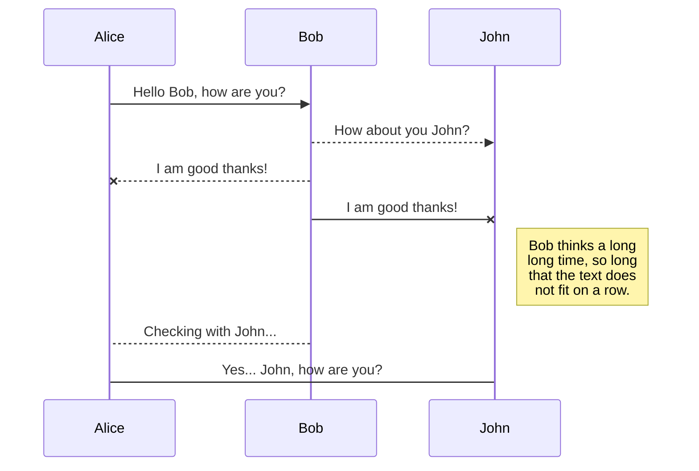
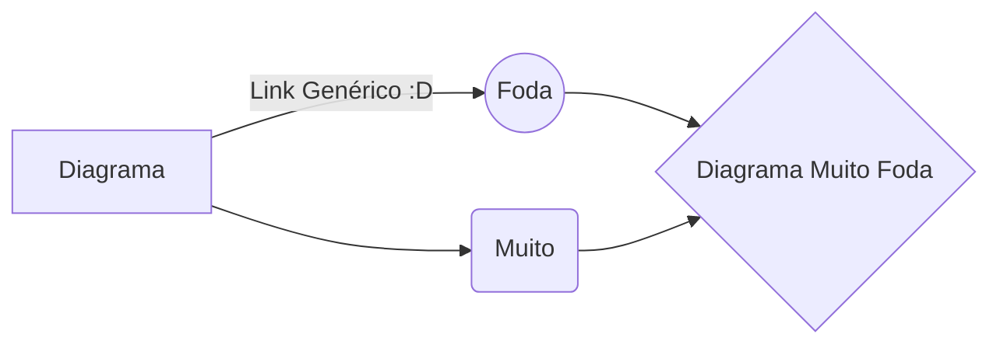

# babyYoda_internet
<h1 align = "center">My first project in github</h1>

Olá, seja bem vindo ao github do esquilo png, eu sou o esquilo.
E nesse repositório eu vou apenas usar para colcoar meus primeiros projetos na disciplina de programação para a internet na minha escola atual IFPR
- Sites de material de Apoio:
	>[Link do material de apoio](https://developer.mozilla.org/pt-BR/)
	>[Link para fazer o README bonitinho](https://stackedit.io/)

# Como vou fazer esse projeto
É apenas um projeto simples de como vamos estudar essa programação atual em js e html para fazer sites na internet, provavelmente não irá seguir para um projeto grande demais, como este é meu primeiro repositório no github, vou fazer um README meio básico e com várias coisas apenas para "encher linguiça" para ter algo já que preciso de pelo menos um "template" inicial para meu primeiro projeto, mesmo que não seja algo grande demais

## Subtítulo

Isso é um subtítulo, aqui eu posso colocar mais **infos** sobre algum arquivo q eu fizer no repositório

## Lista
- Esse é o primeiro item da lista
	> Aqui da pra colcoar alguma *nota* opcional a mais sobre o item acima

- Esse é o segundo item da lista (encheção de linguiça)
	> Mais encheção de **linguiça**

# Outra coisinha pra mostrar

Também tem outros tipos de coisas que da pra colocar no README como esse link > [aqui, que leva ao melho site do mundo](https://youtube.com/c/esquilopng), e ainca colocar mais linguiça depois

> Bacanaa

## Algumas tabelinhas

Algumas tabelinhas que da pra colocar no meu README pra conseguir encher mais linguiça ainda :D

|          Peça      |Tenho?                          |Qual é?                         |
|----------------|-------------------------------|-----------------------------|
|CPU            | Tenho | Ryzen 5
|GPU        |`Tenho`            |RTX          |
|RAM         |`Tenho metade`|8GB (por enquanto)|

## Fórmulas e outras coisas de matemática

Esse é um exemplo que eu já to com preguiça de editar porque já fiz muita coisa, mas olha, da pra colocar coisas de matemática :)

The *Gamma function* satisfying $\Gamma(n) = (n-1)!\quad\forall n\in\mathbb N$ is via the Euler integral

$$
\Gamma(z) = \int_0^\infty t^{z-1}e^{-t}dt\,.
$$

> Sim, eu vou deixar tudo em inglês mesmo

## Diagramas FODAS
Da pra colocar esse bagulho de diagramas muito bacanas

Esse aqui é outro tipo de diagrama que da pra fazer, e de novo... eu vou deixar em inglês pois já estou bem cansado de ficar editando cada coisinha

